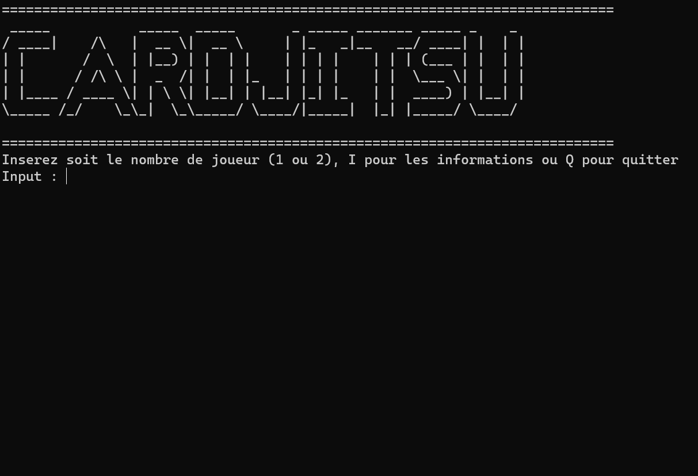
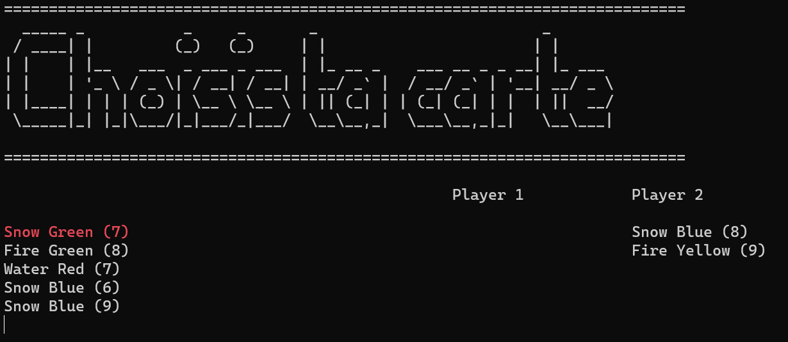

# CardDojo
## Description
This project was made for a university class. It is a recreation of the card game in club penguin.
Currently  only a console version exist.

In the near future we will add code for a custom controller and a console made with an arduino.

The game support two player, but you can play against an AI (He's not that bright) if you don't have anyone else.

## Build
This project was built in visual studio, there's currently no .exe for windows or makefile for linux, but they will come (one day...).

## Game instructions

This is a game of rock, paper, scissor, but with more depth.

Each player have 5 cards. Cards each have a power, an element and a color
### Element
- Water beat Fire
- Fire beat Snow
- Snow beat Water

### Power
if players play the same element instead of a draw, the game compares the power of each cards and the one with the highest power wins the round

### Win conditions
To win the game you must complete one of 2 conditions:
- Have one card of each elements in your winning deck
- Have three different colors of the same element in your winning deck

## Console

In a game you can navigate through your deck using the arrows and select a card with enter

On the right you can see cards you won with and cards your opponent won with

